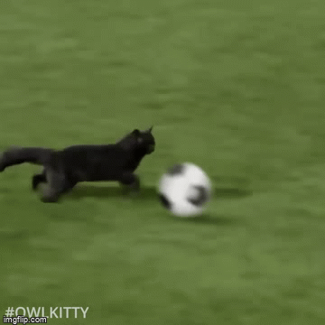
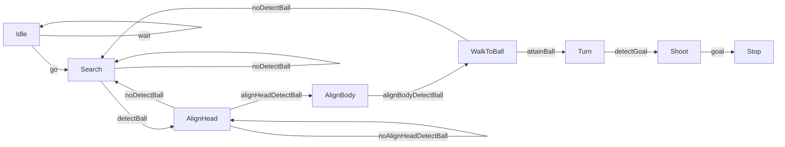

  

# Maradonna


### Auteurs
* DE VAULCHIER Apolline <apolline.de_vaulchier@ensta-bretagne.org> (Promotion ENSTA Bretagne 2024 - Spécialité Robotique Autonome)
* Clara Gondot <clara.gondot@ensta-bretagne.org> (Promotion ENSTA Bretagne 2024 - Spécialité Robotique Autonome)

### Description
Imaginer un futur où les NAO remplacent les joueurs de foot. 

* Objectif principal : faire marquer un but par Nao en utilisant un asservissement visuel.
* Deuxième objectif : faire la passe à un Nao qui ensuite marque 
* Objectifs ultimes : lui apprendre le tacle et simuler la foulure.

### Logiciels
* Simulation sur V-REP
* Environnement virtuel sous python 2.7
* Utilisation de yolov3 : https://github.com/hjinnkim/yolov3-python2.7


## Sommaire
1. [Structure du Git](#structure-du-git)
2. [Informations générales](#informations-générales)
	1. [État du projet](#état-du-projet)
	2. [Travail effectué](#travail-effectué)
	3. [Travail en cours](#travail-en-cours)
    4. [Travail à faire](#travail-à-faire)
3. [Fonctionnement de la FSM](#fonctionnement-de-la-fsm)
4. [Guide d'utilisation](#guide-dutilisation)
   1. [Lancer le robot en simulation](#lancer-le-robot-en-simulation)
   2. [Lancer le robot réel](#lancer-le-robot-réel)

## Structure du Git
Le répertoire GitLab contient les dossiers suivants :
* **images** : contient les images utilisées dans le README.
* **Yolov8** : contient les images utilisées pour l'entrainement de Yolov8 et le modèle entrainé.
* **src** : contient les fichiers python utilisés pour le projet.

## Informations générales
### État du projet
Premier but de Nao Maradonna marqué sous simulation !!!!! 
La vidéo du but est disponible dans le git sous le nom **"video_nao-2023-12-14_11.51.23.mkv"**.
Il faut maintenant passer au stade supérieur : le faire marquer en vrai et en musique !

### Travail effectué
* Détection de la balle
* Détection des coins du but
* Centrer la balle dans l'image
* Marcher jusqu'à la balle
* Aligner la balle, le nao et le but
* Taper dans la balle

### Travail en cours
* Mise en place sur système réel
* Fonction pour lancer plusieurs musique en fonction de l'état du robot (dans la FSM).

### Travail à faire
- [ ] Mettre en place la communication entre le robot et le PC
- [ ] Faire un test son
- [ ] Valider l'apprentissage yolo dans le monde réel
- [ ] Valider nos coefficient dans le monde réel
- [ ] Marquer un but en vrai !

## Fonctionnement de la FSM

## Guide d'utilisation
### Lancer le robot en simulation
+ Sourcer les commandes liées à naoqi dans l'environnement python 2.7 :
```bash
export PYTHONPATH=${PYTHONPATH}:/{Your_path_directory}/UE52-VS-IK/external-software/pynaoqi-python2.7-2.1.4.13-linux64
export LD_LIBRARY_PATH=${LD_LIBRARY_PATH}:/{Your_path_directory}/UE52-VS-IK/external-software/naolibs
export LD_LIBRARY_PATH=${LD_LIBRARY_PATH}:/{Your_path_directory}/UE52-VS-IK/external-software/naoqi-sdk-2.1.4.13-linux64/lib
```
* Ouvrir V-REP.
* Ouvrir le scène **UE52-2021-minigoal-single-nao-yellow-ball.ttt** dans le dossier **vs/scenes** de **UE52-VS-IK**.
* Démarrer la simulation.
* Lancer le script **server.py** dans le dossier **src** sous un environnement python 3.9 au minimum.
* Lancer le script **fsm_nao.py** dans le dossier **src** sous un environnement python 2.7.

**ATTENTION : il faut lancer les scripts en étant dans le dossier /src sinon les chemins ne seront pas les bons pour récupérer les images.**
### Lancer le robot réel
* En cours de développement