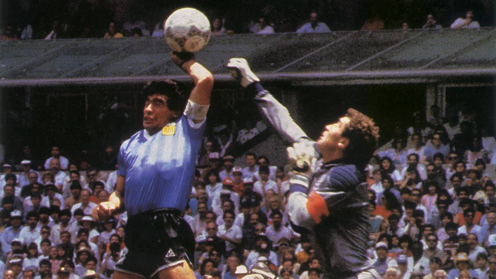
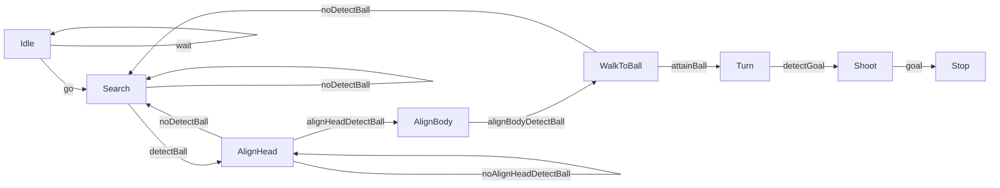

  

# Maradonna :japanese_goblin:


### :alien: Auteurs
* DE VAULCHIER Apolline <apolline.de_vaulchier@ensta-bretagne.org> (Promotion ENSTA Bretagne 2024 - Spécialité Robotique Autonome)
* Clara Gondot <clara.gondot@ensta-bretagne.org> (Promotion ENSTA Bretagne 2024 - Spécialité Robotique Autonome)

### :rabbit: Description
Imaginer un futur où les NAO remplacent les joueurs de foot. 

* Objectif principal : faire marquer un but par Nao en utilisant un asservissement visuel.
* Deuxième objectif : faire la passe à un Nao qui ensuite marque 
* Objectifs ultimes : lui apprendre le tacle et simuler la foulure.

### :blossom: Logiciels
* Simulation sur V-REP
* Environnement virtuel sous python 2.7
* Utilisation de Yolov8 : https://github.com/ultralytics/ultralytics


## :tumbler_glass: Sommaire
1. [Structure du Git](#structure-du-git)
2. [Informations générales](#informations-générales)
	1. [État du projet](#état-du-projet)
	2. [Travail effectué](#travail-effectué)
	3. [Travail en cours](#travail-en-cours)
    4. [Travail à faire](#travail-à-faire)
3. [Guide d'utilisation](#guide-dutilisation)
   1. [Lancer le robot en simulation](#lancer-le-robot-en-simulation)
   2. [Lancer le robot réel](#lancer-le-robot-réel)
4. [Fonctionnement de la FSM](#fonctionnement-de-la-fsm)
   1. [FSM](#fsm) 
   2. [Fonctionnement](#fonctionnement)
   3. [Problèmes rencontrés](#problèmes-rencontrés)

## :crown: Structure du Git
Le répertoire GitLab contient les dossiers suivants :
* **images** : contient les images utilisées dans le README.
* **Yolov8** : contient les images utilisées pour l'entrainement de Yolov8 et le modèle entrainé.
* **src** : contient les fichiers python utilisés pour le projet.

## :banana: Informations générales
### État du projet
Premier but de Nao Maradonna marqué sous simulation !!!!! 
La vidéo du but est disponible dans le git sous le nom **"video_nao-2023-12-14_11.51.23.mkv"**.
Il faut maintenant passer au stade supérieur : le faire marquer en vrai et en musique !

### Travail effectué
* Détection de la balle
* Détection des coins du but
* Centrer la balle dans l'image
* Marcher jusqu'à la balle
* Aligner la balle, le Nao et le but
* Taper dans la balle
* Jouer une musique en fonction de l'état du robot (dans la FSM)
* Mise en place de la connection au robot réel

### Travail en cours
* Récupérer l'image issu de la caméra du robot sur notre serveur pour lancer la détection de la balle et du but.

### Travail à faire
- [x] Mettre en place la communication entre le robot et le PC
- [ ] Régler le problème d'envoie de l'image issu de la caméra du robot sur notre serveur
- [ ] Valider l'apprentissage yolo dans le monde réel

- [ ] Valider nos coefficient dans le monde réel
- [ ] Marquer un but en vrai !

## :rainbow: Guide d'utilisation
### Lancer le robot en simulation
+ Sourcer les commandes liées à naoqi dans l'environnement python 2.7 :
```bash
export PYTHONPATH=${PYTHONPATH}:/{Your_path_directory}/UE52-VS-IK/external-software/pynaoqi-python2.7-2.1.4.13-linux64
export LD_LIBRARY_PATH=${LD_LIBRARY_PATH}:/{Your_path_directory}/UE52-VS-IK/external-software/naolibs
export LD_LIBRARY_PATH=${LD_LIBRARY_PATH}:/{Your_path_directory}/UE52-VS-IK/external-software/naoqi-sdk-2.1.4.13-linux64/lib
```
* Ouvrir V-REP.
* Ouvrir le scène **UE52-2021-minigoal-single-nao-yellow-ball.ttt** dans le dossier **vs/scenes** de **UE52-VS-IK**.
* Démarrer la simulation.
* Lancer le script **server.py** dans le dossier **src** sous un environnement python 3.9 au minimum.
* Lancer le script **fsm_nao.py** dans le dossier **src** sous un environnement python 2.7.

**ATTENTION : il faut lancer les scripts en étant dans le dossier /src sinon les chemins ne seront pas les bons pour récupérer les images.**
### Lancer le robot réel
* Récupérer la branche **reel** du git.
* Changer la variable **mode** dans le fichier **fsm_nao.py** en mettant **mode = "real"**.
* Lancer le script **server.py** dans le dossier **src** sous un environnement python 3.9 au minimum.
* Lancer le script **fsm_nao.py** dans le dossier **src** sous un environnement python 2.7.

## :carousel_horse: Fonctionnement de la FSM
### FSM


### Fonctionnement
* **Idle** : état initial du robot. Le robot attend quelques secondes pour commencer.
* **Search** : le robot tourne sa tête trouver la balle. En fonction de l'angle de la tête, le robot choisit la caméra front ou bottom.
Cet état fait appel à la foncrtion **recv_data_ball** qui fait appel au serveur pour lancer la détection de la balle via notre modèle Yolov8
qui fonctionne sur python3.9 au minimum. Si la balle est détectée, le robot passe à l'état **AlignHead**.
* **AlignHead** : le robot centre sa vision avec la balle. Si la balle n'est plus détectée, le robot retourne à l'état **Search**. Si la balle est centrée, le robot passe à l'état **AlignBody**.
* **AlignBody** : le robot se tourne pour être aligné avec sa tête. Quand le robot est aligné avec la balle, le robot passe à l'état **WalkToBall**.
* **WalkToBall** : le robot marche jusqu'à une certaine distance de la balle. Si la balle n'est plus détectée, le robot retourne à l'état **Search**. Si le robot atteint son objetctif, il passe à l'état **Turn**.
* **Turn** : le robot tourne autour de la balle jusqu'à être aligné avec le but. Quand le but est détecté, le robot passe à l'état **Shoot**. Cet état fait appel à la fonction
**recv_data_goal** qui fait appel au serveur pour lancer la détection du but via notre modèle Yolov8 qui fonctionne sur python3.9 au minimum.
* **Shoot** : le robot marche en direction la balle, se mouvement une fois la balle atteinte va lancer la balle vers l'avant. Le robot passe à l'état **Stop** une fois le temps de marche effectué.

NB: Dans la mise en place en mode "real", pour chaque état, le robot va jouer une musique différente.

### Problèmes rencontrés
Lors de la mise en place du système réel il faut obtenir l'image de la caméra du robot. Pour cela, nous devons envoyer l'image issu du robot sur notre serveur.
L'image issu de la caméra est un tableau numpy que nous envoyons via le package **pickle**. Cependant, nous arrivons à envoyer un tableau numpy pour la fonction
**recv_data_goal** mais pas pour envoyer l'image issu de la caméra du robot. Ainis, le serveur s'interrompt et nous n'avons pas pu faire fonctionner le NAO en mode réel malheureusement.
